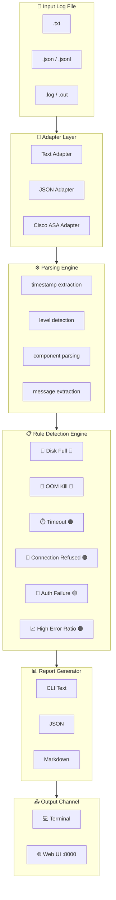

<div align="center">
  <h1>🔍 DevOps Incident Analyzer</h1>
  <p><strong>Instant Log Triage — No LLM Required</strong></p>
  <p><em>Turn noisy logs into actionable incident summaries in seconds.</em></p>

  <p>
    <a href="#-features"><strong>Features</strong></a> •
    <a href="#-quick-start"><strong>Quick Start</strong></a> •
    <a href="#-usage"><strong>Usage</strong></a> •
    <a href="#-architecture"><strong>Architecture</strong></a> •
    <a href="#-extending"><strong>Extending</strong></a>
  </p>

  <p>
    
    
    
    
    
    
  </p>
</div>

---

## 💡 Why This Exists?

**You're in the middle of an incident.** PagerDuty is firing, Slack is exploding, and logs are streaming in faster than you can read. You need to understand *what broke* — fast.

Most observability platforms are great at showing *that* something is wrong, but they don't tell you *what patterns to look for*. This tool fills that gap:

> **The DevOps Incident Analyzer** turns a raw log dump into a focused triage report — spotting disk-full errors, OOM kills, timeout cascades, auth failures, and connectivity issues — without a single API call to an LLM.

### Who is this for?

| Role | What it does for you |
|------|---------------------|
| 🧑‍💻 **SRE / DevOps Engineer** | First-pass log triage during incidents, no cloud dependency |
| 👨‍💼 **Engineering Manager** | Quantify incident frequency, identify recurring failure patterns |
| 🏢 **Platform Team** | Embed in incident response pipelines, extend with custom rules |
| 🎓 **Cloud Enthusiast** | Learn rule-based detection, multi-adapter parsing, streaming analysis |

### The Problem

- **Manual log scanning is slow.** Engineers waste 15-30 minutes reading logs to understand what's happening.
- **Context gets lost.** During an incident, it's easy to miss the signal in the noise.
- **Runbooks are disconnected.** The knowledge of "what to look for" lives in people's heads, not in your tooling.
- **Vendor lock-in.** Most log analytics tools require cloud subscriptions or complex stack setups.

### The Solution

A single-file analyzer that:

1. **Parses** logs in plain text, JSON, or Cisco ASA formats
2. **Detects** known failure patterns with zero external dependencies
3. **Summarizes** the incident in a human-readable report
4. **Exports** to CLI, JSON, Markdown, or an embedded web UI
5. **Works offline** — no internet, no API keys, no setup

---

## ✨ Features

- 🔍 **Rule-based detection** — disk full, OOM, timeouts, connection failures, auth issues
- 📂 **Multi-format support** — plain text, JSON/JSONL, Cisco ASA logs
- ⚡ **Streaming parser** — handles large log files without loading into memory
- 🌐 **Web UI** — drag-and-drop log upload with rendered incident reports
- 📊 **Multiple output formats** — CLI table, JSON, Markdown
- 📈 **Component aggregation** — identify which service or process is most noisy
- 🧩 **Extensible rules** — add your own detection patterns in minutes
- 🚫 **Zero dependencies** — pure Python 3.10+, no pip install required

---

## 🚀 Quick Start

### Prerequisites

- **Python 3.10+** — [Download](https://www.python.org/downloads/)

### Get Started in 10 Seconds

```bash
# Clone the repo
git clone https://github.com/jadhav-prathamesh/New-Projects.git
cd New-Projects

# Analyze the sample log
python log_analyzer.py sample_logs.txt
```

That's it. No `pip install`, no environment setup, no API keys.

---

## 📖 Usage

### 🔹 CLI Mode — Quick Analysis

```bash
# Analyze any log file
python log_analyzer.py path/to/your.log

# Use an explicit adapter for specific formats
python log_analyzer.py cisco_asa_sample.txt --adapter cisco-asa
python log_analyzer.py json_logs_sample.jsonl --adapter json

# Export as JSON
python log_analyzer.py sample_logs.txt --format json

# Export as Markdown
python log_analyzer.py sample_logs.txt --format markdown
```

### 🔹 Web UI — Drag & Drop

```bash
python log_analyzer.py --web
```

Then open **http://127.0.0.1:8000** in your browser, upload a `.txt`, `.log`, `.out`, or `.json` file, and get a beautiful visual report instantly.

### 📋 Sample Output

```text
Incident Analysis Report: sample_logs.txt
Lines processed: 12
Time range: 2026-04-07 09:00:01 -> 2026-04-07 09:00:30
Log levels: ERROR=8, CRITICAL=1, FATAL=0, WARN=1, INFO=2, UNKNOWN=0
Error ratio: 75.0%

Top components:
- payments: 4 lines
- api-gateway: 3 lines
- worker: 3 lines

Detected issues:
- [CRITICAL] Disk capacity issue detected. (matches: 2)
- [HIGH] Repeated timeout behavior detected. (matches: 4)
```

---

## 🏗️ Architecture



---

### Project Structure

```
New-Projects/
├── log_analyzer.py          # Parser, analyzer, CLI, JSON export, web server
├── adapters.py              # Parser adapters for text, JSON, Cisco ASA
├── rules.py                 # Detection rules, thresholds, severity ordering
├── sample_logs.txt          # Sample log file for quick testing
├── json_logs_sample.jsonl   # Sample structured JSON log input
├── cisco_asa_sample.txt     # Sample Cisco ASA-style log input
├── .gitignore
├── LICENSE                  # Apache 2.0
├── pyproject.toml           # Package metadata
├── CONTRIBUTING.md          # Contribution guidelines
├── CODE_OF_CONDUCT.md       # Community standards
├── SECURITY.md              # Security policy
└── .github/                 # Issue & PR templates
    ├── ISSUE_TEMPLATE/
    │   ├── bug_report.md
    │   └── config.yml
    └── PULL_REQUEST_TEMPLATE.md
```

---

## 🔧 Supported Detection Rules

| Rule | Severity | Pattern Description |
|------|----------|-------------------|
| `disk_full` | 🔴 CRITICAL | No space left, disk full, filesystem full |
| `out_of_memory` | 🔴 CRITICAL | OOM killed, cannot allocate memory |
| `timeout` | 🟠 HIGH | Timed out, deadline exceeded |
| `connection_refused` | 🟠 HIGH | Connection refused, host unreachable |
| `authentication_failure` | 🟡 MEDIUM | Auth failed, access denied, unauthorized |
| `high_error_frequency` | 🟠 HIGH | >20% error ratio or >5 error lines |

---

## 🔌 Extending the Analyzer

### Adding a Custom Rule

Edit `rules.py` and add a new `DetectionRule`:

```python
DetectionRule(
    name="ssl_cert_expired",
    severity="high",
    pattern=re.compile(
        r"(certificate expired|SSL certificate|TLS handshake failed)",
        re.IGNORECASE,
    ),
    summary="SSL/TLS certificate issue detected.",
    suggestion="Check certificate expiry dates and renewal automation.",
)
```

### Adding a Custom Adapter

Edit `adapters.py` and add a new parser function. See `parse_text_line`, `parse_json_line`, or `parse_cisco_asa_line` as examples.

---

## 🧪 Real-World Scenario

> **Scenario:** A payment platform during a weekend traffic spike. Alerts fire for failed checkouts, increased latency, and worker instability.

An engineer exports logs from the API gateway, payment service, worker processes, and auth layer, then runs them through the analyzer. Within seconds, the report reveals:

- ⏱️ **Timeout errors** clustered around payment and order service calls
- 💾 **Disk full** condition on one worker node
- 🧠 **OOM kill** in a background reconciliation job
- 🔑 **Auth failures** affecting a service account used by automation

Instead of reading thousands of lines manually, the responder gets a structured triage summary that points to the most likely starting points.

---

## ⚙️ Configuration

No configuration file is needed. Everything is controlled via CLI flags:

| Flag | Description | Default |
|------|-------------|---------|
| `logfile` | Path to the log file | Required |
| `--format` | Output format: `text`, `json`, `markdown` | `text` |
| `--adapter` | Parser: `auto`, `text`, `json`, `cisco-asa` | `auto` |
| `--web` | Start the web interface | off |
| `--host` | Web host | `127.0.0.1` |
| `--port` | Web port | `8000` |

---

## 🗺️ Roadmap

- [ ] **Richer structured JSON parsing** — nested objects, array-based logs
- [ ] **Additional rules** — SSL, DNS, CPU saturation, restart loops
- [ ] **HTML export** — standalone report files for sharing
- [ ] **Test suite** — pytest regression coverage
- [ ] **Optional LLM layer** — explain rule-based findings with natural language
- [ ] **GitHub Actions CI** — automated testing and linting

---

## 🤝 Contributing

We ❤️ contributions! Whether you're fixing a typo, adding a detection rule, or improving the web UI — you're welcome here.

👉 See [CONTRIBUTING.md](CONTRIBUTING.md) for detailed guidelines.

---

## 📜 License

This project is licensed under the **Apache License 2.0** — see [LICENSE](LICENSE) for details.

---

## 💬 Questions? Ideas? Issues?

| Channel | Purpose |
|---------|---------|
| [🐛 GitHub Issues](https://github.com/jadhav-prathamesh/New-Projects/issues) | Bug reports, feature requests |
| [💬 GitHub Discussions](https://github.com/jadhav-prathamesh/New-Projects/discussions) | Questions, ideas, community |

---

<div align="center">
  <sub>Built with ❤️ for faster incident triage | Made better by the community</sub>
</div>

